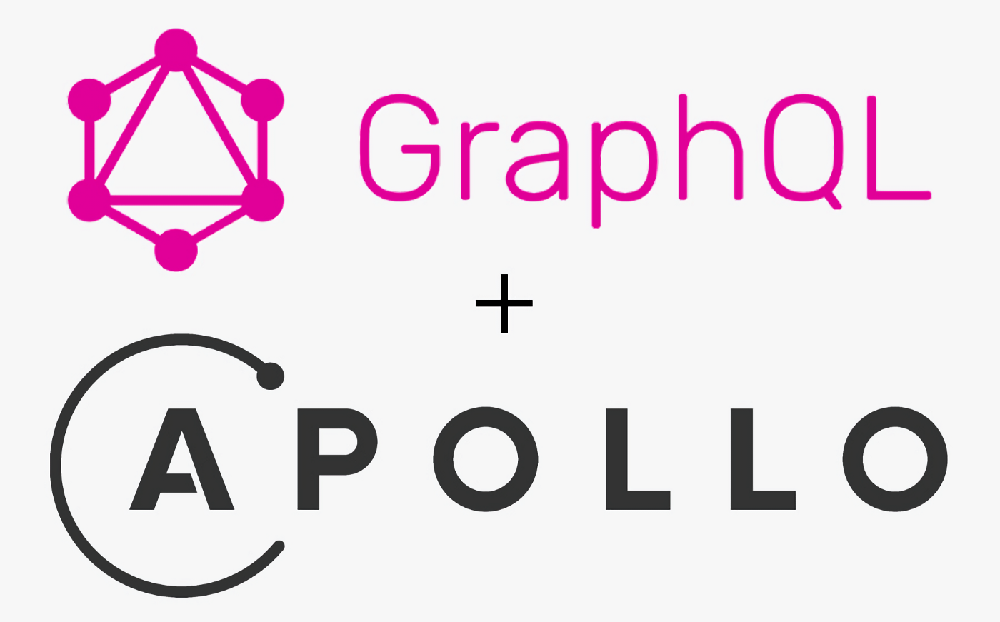

<h1 align="center"><strong>GraphQL: Apollo Server Boilerplate Code [Node.js]</strong></h1>

## Introduction

It takes time doing config over and over again for the same projects when the changes are marginal. Kickstart your new GraphQL and Apollo project today with this simple boilercode solution allowing you to setup a server in seconds.

## Quickstart

Simply navigate to the boilerplate code located in the [index.js](https://github.com/conorjkelly96/graphql-boilerplate-code/blob/main/src/index.js) file located in the `src` directory of this GitHub repository.

## Official Documentation

Apollo GraphQL official has released a step by step server guide, which can be found [here.](https://www.apollographql.com/docs/apollo-server/getting-started/)

## Contributing

The GraphQL boilerplates are maintained by the GraphQL community, with official support from the [Apollo](https://blog.apollographql.com/) teams.
